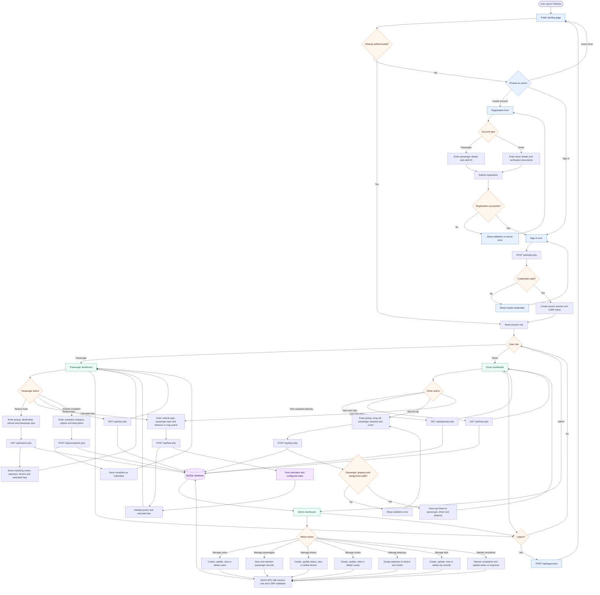

# PoloNav System Flowchart

The diagram below describes the current application flow for the PoloNav
Antipolo jeepney route and passenger management system.

## Role boundaries

- **Passenger:** can search routes, calculate fares, view personal trips, and
  submit or review personal complaints.
- **Driver:** can view assigned vehicles and record trips for the assigned
  driver identity.
- **Admin:** can manage users, passengers, drivers, routes, jeepneys, trips,
  and complaint resolution.
- **Shared controls:** authenticated API access, role checks, CSRF-protected
  writes, prepared database queries, and session-based redirects.
